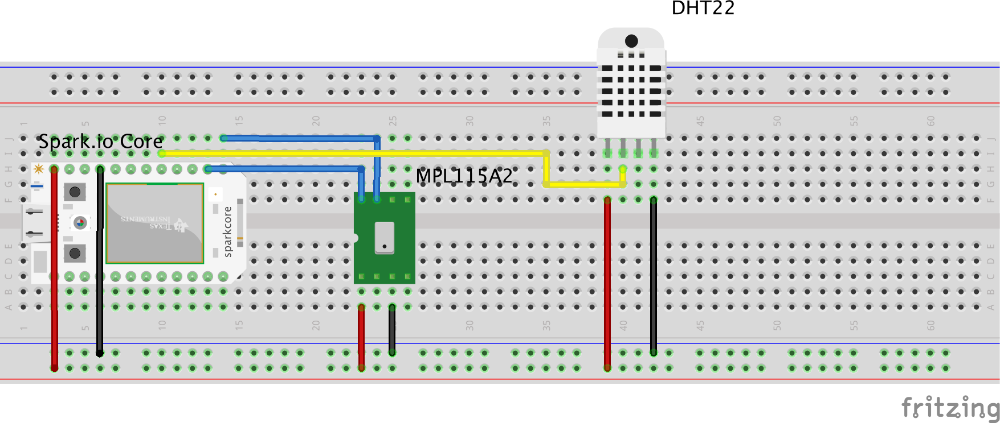
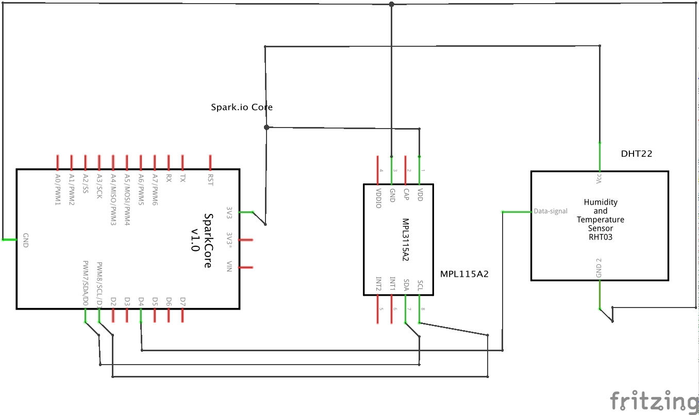

# Spark Core based Weather Station

This little assembly uses a Spark.io Core and two digital sensor to measure weather data.
The first sensor is the [MPL115A2 from Adafruit](https://www.adafruit.com/products/992). A barometric temperature and pressure sensor which communicates via the I2C protocol.
The other sensor is the [DHT22 from Adarfuit](https://www.adafruit.com/products/385), a digital temperature and humidity sensor.

The [Spark Core](http://spark.io/) itself is a tiny Arduino compatible computer that has built-in WiFi and Cloud connectivity. You can easily read and write it's pins from remote via the Spark Cloud.

# wiring 
I use a standard breadboard to connect all the components

## Material

 * [MPL115A2 from Adafruit](https://www.adafruit.com/products/992)
 * [DHT22 from Adarfuit](https://www.adafruit.com/products/385)
 * [Spark.io Core from Tinkersoup Berlin](https://www.tinkersoup.de/a-1545/)
