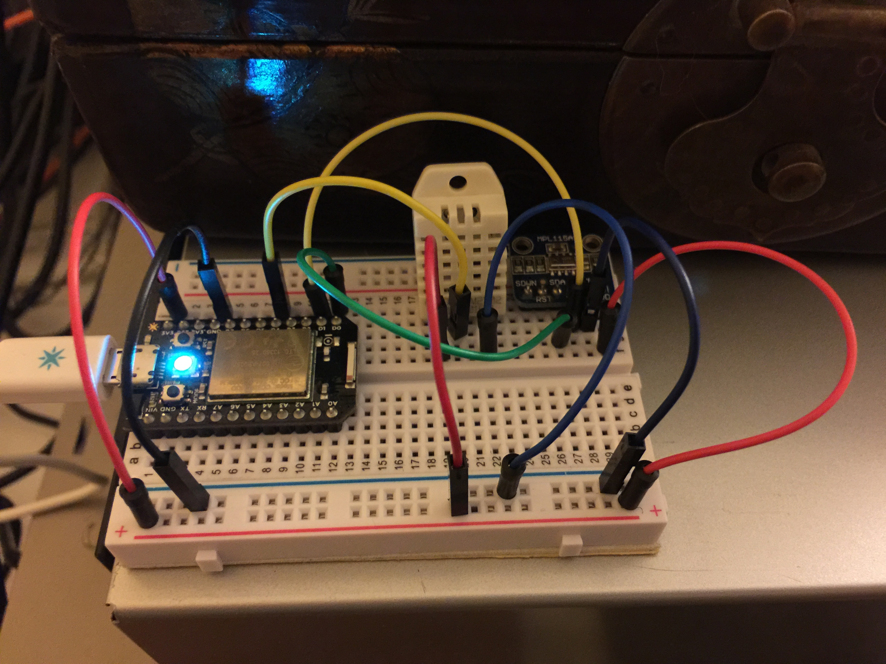

# Spark Core based Weather Station

This little assembly uses a Spark.io Core and two digital sensor to measure weather data.
The first sensor is the [MPL115A2 from Adafruit](https://www.adafruit.com/products/992). A barometric temperature and pressure sensor which communicates via the I2C protocol.
The other sensor is the [DHT22 from Adarfuit](https://www.adafruit.com/products/385), a digital temperature and humidity sensor.

The [Spark Core](http://spark.io/) itself is a tiny Arduino compatible computer that has built-in WiFi and Cloud connectivity. You can easily read and write it's pins from remote via the Spark Cloud.

# wiring 
I use a standard breadboard to connect all the components

## Material

 * [MPL115A2 from Adafruit](https://www.adafruit.com/products/992)
 * [DHT22 from Adarfuit](https://www.adafruit.com/products/385)
 * [Spark.io Core from Tinkersoup Berlin](https://www.tinkersoup.de/a-1545/)
 * Standard Breadboard
 * a few jumper cables

## Folders
### images
Contains the images the are used to generate this website. Things like the [Fritzing](http://fritzing.org/home/) Schemas etc.
### firmware_binary
A compiled version of the Spark Code code from the spark-code folder. This includes the external libraries.

You can either download this from the Spark.io Workbench in the web or compile it with the Spark.io Command Line tools.
### spark-core
The source code of Spark Core file. This contains some external libraries for the two sensors. They are from Adafruits Github account:

 * [MPL115A2 Driver](https://github.com/adafruit/Adafruit_MPL115A2)
 * [DHT22 Driver](https://github.com/adafruit/DHT-sensor-library)

### misc
Some miscellaneous files like shell scripts to generate graphs.
### web
contains the web files for the RRD graphs of the temperature readings